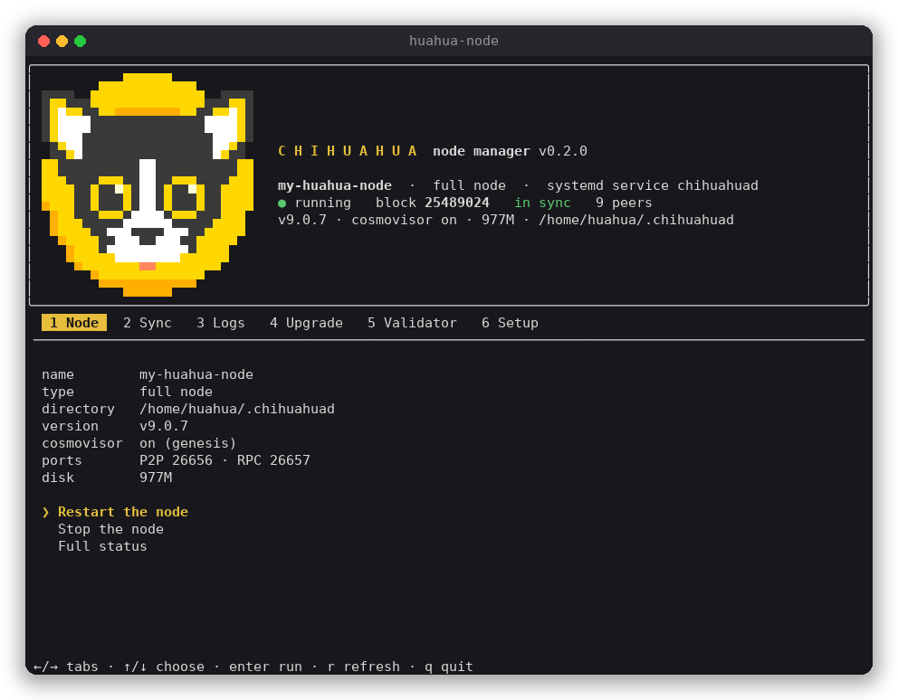
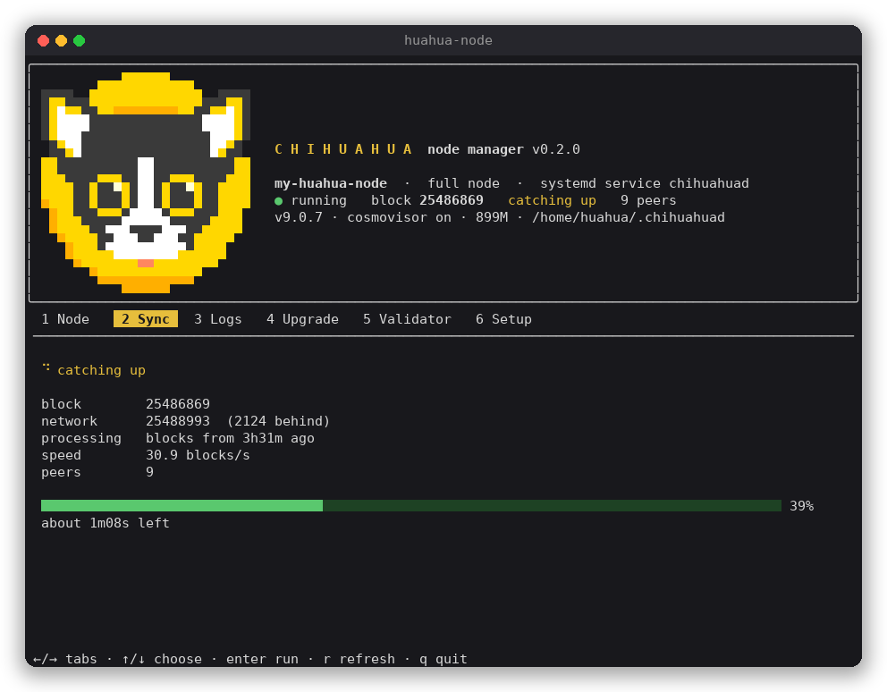
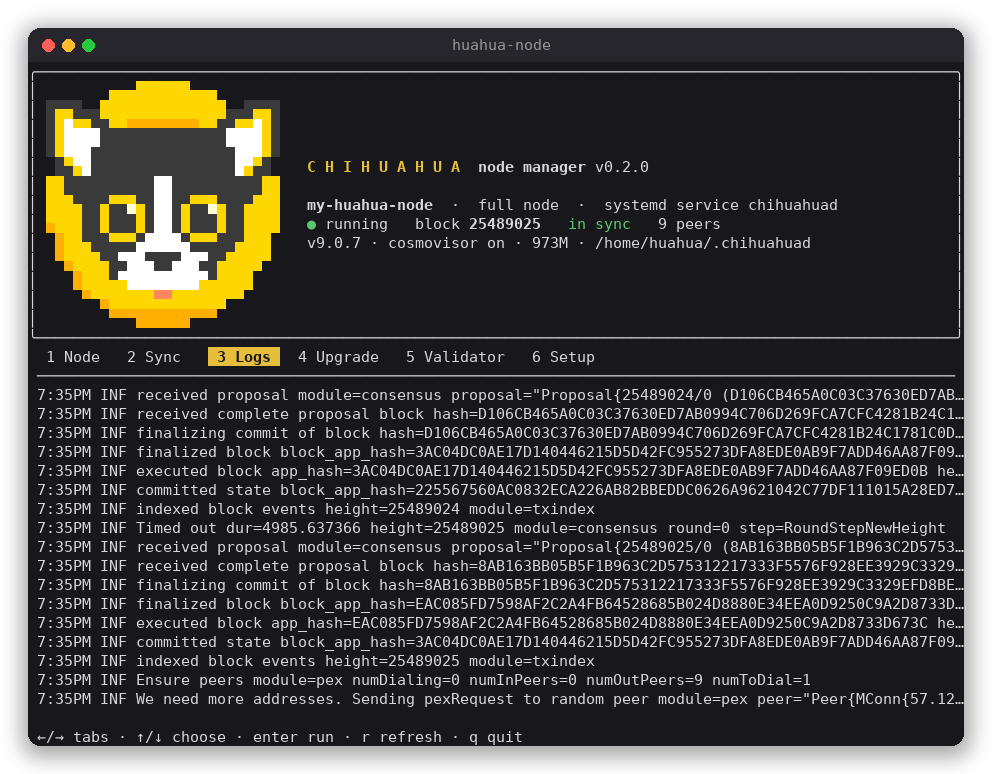
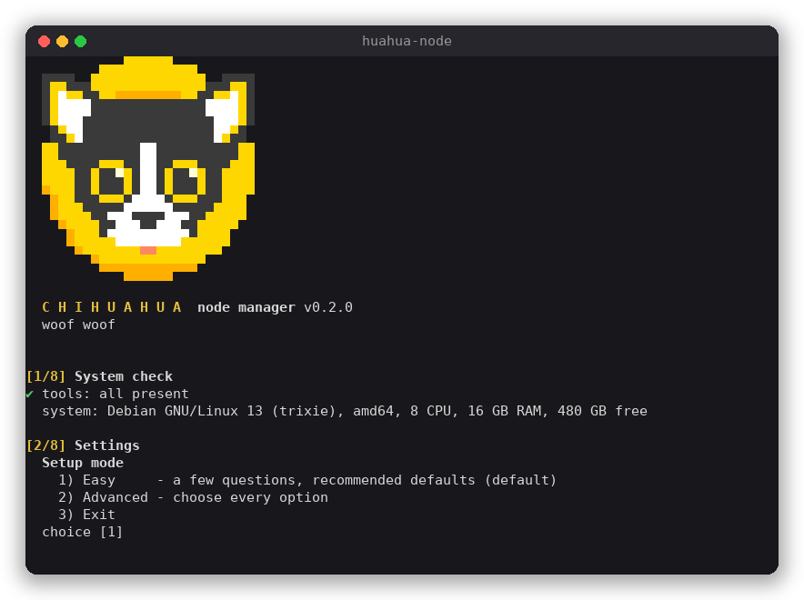

<p align="center">
  
</p>

<h1 align="center">Huahua Node Manager</h1>

<p align="center">
  Set up and manage a <a href="https://chihuahua.wtf">Chihuahua</a> node from one command:<br>
  snapshot or state sync in minutes, cosmovisor, systemd or Docker, live terminal dashboard.
</p>

<p align="center">
  <a href="LICENSE"></a>
  
  
</p>

<p align="center">
  
</p>

## Quick start

```sh
bash <(curl -fsSL https://raw.githubusercontent.com/ChihuahuaChain/huahua-node-manager/main/huahua-node.sh)
```

Choose **Easy**, answer three questions, and a few minutes later you have a node that is:

- synced;
- running under cosmovisor;
- started at boot.

Run the same command again, or `huahua-node`, to open the dashboard.

To read the script before running it:

```sh
curl -fsSLO https://raw.githubusercontent.com/ChihuahuaChain/huahua-node-manager/main/huahua-node.sh
less huahua-node.sh
bash huahua-node.sh
```

## What it does

- **Fast sync:**
  - downloads the latest snapshot from [snapshots.chihuahua.wtf](https://snapshots.chihuahua.wtf), refreshed every 12 hours: a synced node in about a minute;
  - or restores the state from the network peers with state sync.
- **Verified downloads:** the `chihuahuad` release, cosmovisor, the genesis and the snapshot are all checked against their sha256 before use.
- **Automatic upgrades:** an hourly check prepares the upgrade scheduled by governance, and cosmovisor switches the binary at the upgrade height. It can be turned on and off at any time; `huahua-node upgrade` prepares an upgrade by hand, even while its proposal is still in voting.
- **Two ways to run:** a systemd service, or a Docker container (`docker compose`, host network).
- **Networking:**
  - finds live peers and picks free ports;
  - announces the public IP;
  - opens the P2P port on ufw or firewalld;
  - checks from the internet that the port is reachable.
- **Existing nodes:** finds a node already running on the machine (systemd, Docker or started by hand) and manages it. It can move it under cosmovisor.
- **Validators:** a guided `create-validator`, from the key to the broadcast. It always asks before sending.
- **Live dashboard:** block, sync, peers and logs in the terminal, with the node actions one key away.

## The dashboard

On a terminal, `huahua-node` opens a full screen dashboard. The logo and the node state stay on top; six tabs sit below.

| Tab | Shows | Actions |
|---|---|---|
| **1 Node** | name, type, directory, version, cosmovisor, ports, disk | start, stop, restart, add cosmovisor, full status |
| **2 Sync** | block, network height, blocks behind, speed, progress bar, time left, state sync phase | restart from the snapshot (state sync nodes) |
| **3 Logs** | the live node log, errors in red and warnings in yellow | |
| **4 Upgrade** | running version, scheduled upgrade, upgrade proposals in voting, binaries prepared for cosmovisor, automatic upgrades on/off with the last and next check | prepare the scheduled upgrade (or the one in voting), turn automatic upgrades on or off |
| **5 Validator** | voting power, active set | create the validator |
| **6 Setup** | | set up another node, uninstall |

Keys:

- `←` `→`, `Tab` or `1`…`6` switch tabs;
- `↑` `↓` and `Enter` run an action;
- `r` refreshes;
- `q` quits.

Steps that ask questions run on the normal screen, then come back to the dashboard.

<p align="center">
  
  
</p>

## Setup

<p align="center">
  
</p>

**Easy** asks for the node type, systemd or Docker, and the node name. **Advanced** asks for every option below.

| Option | Default | Choices |
|---|---|---|
| Node type | full node | full node, validator |
| Runs with | systemd service | systemd service, Docker |
| Directory | `~/.chihuahuad` | any path |
| Sync | snapshot | snapshot, state sync |
| Pruning | pruned: keep the last 100 states | pruned, default, everything, nothing, custom |
| Blocks to keep (`min-retain-blocks`) | all | any number |
| Transaction indexing | on for full nodes, off for validators | on, off |
| P2P interface | all interfaces | each interface of the machine |
| Ports | 26656 / 26657, or the first free offset | offset of 1000, 2000… |
| RPC | this machine only | this machine, the network |
| REST API and gRPC | off | on, off |
| Minimum gas price | `500uhuahua` | any price |
| Cosmovisor | on | on, off |

The setup runs in eight steps:

1. **System check:** installs the missing tools (`curl`, `jq`, `lz4`) and checks CPU, RAM and disk.
2. **Settings:** the options above.
3. **Summary:** shows every choice and asks to proceed.
4. **Binaries:** downloads and verifies `chihuahuad` and cosmovisor.
5. **Configuration:** writes `config.toml`, `app.toml` and `client.toml`, with peers, ports, pruning and gas price.
6. **Chain state:** downloads the snapshot, or prepares the state sync.
7. **Service:** starts the systemd service or the container.
8. **Checks:** RPC and P2P port, then live sync progress until the node is in sync.

**If the sync stalls.** With no progress for 5 minutes, or on `Ctrl-C` while watching, the setup asks what to do:

- keep watching;
- let the node sync in the background;
- restart from the snapshot;
- abort and remove everything it downloaded.

**sudo.** The systemd service needs `sudo` once. The setup explains why and asks for the password. If `sudo` fails it offers to try again, or to run the node with Docker instead.

**Replacing a node.** When the node directory already exists, the setup asks before replacing it. The keys and the node identity are kept.

## Existing nodes

When a node is already on the machine, `huahua-node` shows it and offers the actions on it.

It detects:

- the nodes it installed, running or not;
- any `chihuahua-1` node running as a systemd service, as a Docker container, or started by hand. Nodes of other networks are ignored.

**Add cosmovisor** puts an existing node under cosmovisor:

- it keeps the start flags of the current command;
- it backs up the systemd unit;
- it respects the `upgrade-info.json` left by past upgrades, so cosmovisor does not apply an old upgrade again;
- a node started by hand becomes a systemd service.

## Commands

| Command | |
|---|---|
| `huahua-node` | the dashboard on a terminal, the setup otherwise |
| `huahua-node install` | the step by step setup |
| `huahua-node status` | height, sync, peers, version, disk, scheduled upgrade, upgrade proposals in voting, automatic upgrades |
| `huahua-node watch` | live sync progress |
| `huahua-node logs` | follow the node log |
| `huahua-node upgrade [tag [name]]` | fetch the binary of the scheduled upgrade (or of the one in voting) into cosmovisor |
| `huahua-node auto-upgrade [on\|off\|status]` | turn the automatic upgrades on or off, or show their state |
| `huahua-node validator` | create the validator |
| `huahua-node uninstall` | remove the node, backing up the keys first |
| `huahua-node update` | update the Huahua Node Manager itself to the latest release |
| `huahua-node help` | usage and variables |

The manager installs itself as `/usr/local/bin/huahua-node` (or `~/.local/bin/huahua-node` without sudo) the first time it runs.

At every start it checks the [latest release](https://github.com/ChihuahuaChain/huahua-node-manager/releases/latest). When a newer one is out it asks whether to update, then downloads it, checks its sha256 and restarts on it. `HUAHUA_NO_UPDATE=1` skips the check, and `HUAHUA_AUTO_UPDATE=1` updates without asking (for scripts). Without a terminal it only prints a notice.

## Unattended installs

Every question can be answered with an environment variable. `HUAHUA_YES=1` takes the default for the rest.

```sh
# a full node with Docker, on the first free ports
HUAHUA_YES=1 INSTALL_TYPE=docker MONIKER=my-node \
  bash huahua-node.sh install

# a validator, systemd service, no transaction index, custom pruning
HUAHUA_YES=1 NODE_ROLE=validator MONIKER=my-validator \
  SETUP_MODE=advanced PRUNING=custom KEEP_RECENT=1000 PRUNE_INTERVAL=10 INDEXER=null \
  bash huahua-node.sh install

# RPC open to the network, REST API and gRPC on this machine, synced with state sync
HUAHUA_YES=1 MONIKER=my-rpc SETUP_MODE=advanced SYNC=statesync \
  RPC_PUBLIC=yes API=yes INDEXER=kv \
  bash huahua-node.sh install
```

Without a terminal, the systemd mode needs `sudo` without a password. Otherwise use `INSTALL_TYPE=docker`.

Setup variables:

| Variable | Values |
|---|---|
| `SETUP_MODE` | `easy`, `advanced` |
| `NODE_ROLE` | `full`, `validator` |
| `INSTALL_TYPE` | `native`, `docker` |
| `MONIKER` | node name |
| `NODE_HOME` | node directory |
| `COMPOSE_DIR` | Docker compose directory, default `~/chihuahua-node` |
| `SYNC` | `snapshot`, `statesync` |
| `PRUNING` | `pruned`, `default`, `everything`, `nothing`, `custom` (with `KEEP_RECENT`, `PRUNE_INTERVAL`) |
| `MIN_RETAIN_BLOCKS` | number, `0` keeps every block |
| `INDEXER` | `kv`, `null` |
| `LISTEN_IP` | P2P listen address |
| `PORT_OFFSET` | `auto`, `0`, `1000`, … |
| `EXTERNAL_IP` | address announced to peers |
| `RPC_PUBLIC` | `yes`, `no` |
| `API` | `yes`, `no` |
| `MIN_GAS_PRICE` | e.g. `500uhuahua` |
| `COSMOVISOR` | `yes`, `no` |
| `AUTO_DOWNLOAD` | `yes`, `no`: cosmovisor downloads upgrade binaries by itself |
| `AUTO_UPGRADE` | `yes` (default with cosmovisor and systemd), `no`: the hourly check that prepares scheduled upgrades |

Behaviour variables:

| Variable | Effect |
|---|---|
| `HUAHUA_YES=1` | take the defaults, never wait for an answer |
| `HUAHUA_REPLACE=1` | replace an existing node directory (keys are kept) |
| `HUAHUA_ACTION` | one action on the node found: `status`, `watch`, `logs`, `start`, `stop`, `restart`, `cosmovisor`, `upgrade`, `validator`, `uninstall`, `setup` |
| `HUAHUA_SYNC_ACTION` | when the sync stalls: `wait`, `background`, `snapshot`, `abort` |
| `STALL_SECS` | seconds without progress before asking, default `300` |
| `HUAHUA_PLAIN=1` | no full screen dashboard |
| `HUAHUA_SNAPSHOT_URL` | another snapshot server |

## Upgrades

Chain upgrades are decided by governance: a software upgrade proposal names the upgrade (for example `v10.0.0`) and the block height where it happens. When the proposal passes, the upgrade is **scheduled**. At that height every node stops, and must restart on the new `chihuahuad`.

With cosmovisor, the switch at the height happens by itself. The node only needs the new binary in `cosmovisor/upgrades/<name>/bin` before the height: preparing it is what the Huahua Node Manager does.

### Automatic upgrades

When automatic upgrades are on, a systemd timer runs `huahua-node auto-upgrade run` every hour (and 5 minutes after boot). Each run:

1. asks the node whether an upgrade is scheduled;
2. if one is, and its binary is not prepared yet, finds the matching `chihuahuad` release on GitHub, downloads it, checks its sha256 and that it runs, and places it in `cosmovisor/upgrades/<name>/bin`;
3. if none is, only logs the upgrade proposals still in voting: nothing is installed before governance has approved it.

It never restarts the node and never touches the running binary: cosmovisor still does the switch, at the height decided on chain. If the node RPC does not answer, or the release is not published yet, the run logs it and tries again an hour later.

Why hourly: an expedited proposal gives only a few hours between the end of the vote and the upgrade height, so a daily check could come too late. Compared with letting cosmovisor download the binary at the height (`AUTO_DOWNLOAD`), the binary is in place and verified hours before, and the upgrade does not depend on GitHub answering at that exact moment.

Turn them on or off at any time:

```sh
huahua-node auto-upgrade on       # install and start the hourly timer
huahua-node auto-upgrade off      # remove the timer: upgrades are prepared by hand again
huahua-node auto-upgrade status   # on or off, last and next check
journalctl -u huahua-node-upgrade-$USER   # what each check did
```

Or from the dashboard: tab **4 Upgrade**, "Turn automatic upgrades on/off".

- New nodes: the setup turns them on when the node uses cosmovisor and the machine has systemd (in the advanced setup you choose; `AUTO_UPGRADE=no` for an unattended install without them).
- Nodes installed before 0.3.2, or adopted nodes: off until you turn them on.
- The timer runs as the user who turned it on, who must be able to write the node directory. The units are `/etc/systemd/system/huahua-node-upgrade-<user>.{service,timer}`; `huahua-node uninstall` removes them.
- Docker nodes: the timer runs on the host and writes into the node directory mounted in the container.

### By hand

1. `huahua-node status`, and the dashboard, show the scheduled upgrade and the upgrade proposals in voting.
2. `huahua-node upgrade` does the rest:
   - reads the upgrade name from the chain, or from the proposal in voting when nothing is scheduled yet (it asks first: the binary is used only if the proposal passes);
   - finds the matching release, for example `v10` becomes `v10.0.0`;
   - verifies the binary and registers it with cosmovisor.

At the upgrade height the node stops, cosmovisor switches the binary and the node starts again, with no one watching.

```sh
huahua-node upgrade                    # the scheduled upgrade, or the one in voting
huahua-node upgrade v10.0.0 v10.0.0    # a given release for a given upgrade name
```

## Becoming a validator

1. Set up a node as **Validator**, or use a synced full node.
2. Run `huahua-node validator`, or open the **Validator** tab.
3. The guide:
   - waits for the node to be in sync;
   - creates or recovers the key, in a password protected `file` keyring in the node directory;
   - shows the address and waits for funds;
   - asks for the self-delegation, commission, website, identity and contact;
   - writes `validator.json`, shows the transaction and asks before broadcasting it.

Back up `config/priv_validator_key.json` offline, and never run the same key on two nodes.

## Files

| Path | |
|---|---|
| `~/.chihuahuad` | node directory: `config`, `data`, `cosmovisor`, `bin` |
| `/etc/systemd/system/chihuahuad.service` | the systemd service |
| `~/chihuahua-node/docker-compose.yml` | the Docker setup |
| `~/.huahua-node.env` | the settings of the installation |
| `~/chihuahua-backup-<date>` | key backups made before a replace or an uninstall |

## Security

- Every download is verified against its sha256 before it is used.
- Keys never leave the machine. A replace or an uninstall backs them up to a `chmod 700` directory first.
- `sudo` is only needed for the systemd service, the missing packages and the firewall port. The Docker mode runs as the current user.
- The validator transaction is shown in full and sent only after an explicit yes.

## Troubleshooting

**No peers.** Outbound TCP may be blocked. Or another node is already running behind the same public IP: peers refuse a second connection from the same address.

**P2P port not reachable from the internet.** Forward the port on the router or firewall. The node syncs without it, but gets no inbound peers.

**State sync does not progress.** From the Sync tab, or from the question the setup asks, restart from the snapshot.

**Empty Logs tab (systemd).** Reading the journal needs the `systemd-journal` group:

```sh
sudo usermod -aG systemd-journal $USER
```

**Docker permission denied.** Add the user to the `docker` group:

```sh
sudo usermod -aG docker $USER
```

Log in again after either `usermod`.

## Requirements

| | |
|---|---|
| System | Linux, amd64 or arm64 |
| Runs with | systemd and sudo, or Docker with the compose plugin |
| Recommended | 4 CPU, 8 GB RAM, 50 GB of free disk |
| Tools | `bash`, `curl`, `jq`, `lz4`, `tar`: missing ones are installed |

## License

[Apache License 2.0](LICENSE)
